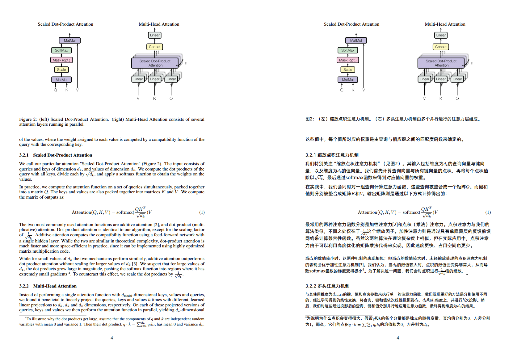

<!-- ============================ TOP BANNER ============================ -->
> # Recommended translation service: TuringEvo Hosted API
>
> **Sign up → get an API key → point the tool at the endpoint. Three steps, no local model required.**
>
> - Sign up: **https://api.turingevo.com**
> - World-class AI models: **https://api.turingevo.com/pricing**
> - Endpoint: `https://api.turingevo.com/v1/chat/completions`
> - Model: `tencent/Hunyuan-MT-7B`
> - QQ group: `873673497`

[简体中文](README.md) ｜ **English**

---

# turing-pdf-skill



## What is this

`turing-pdf-skill` is an **agent skill** that wraps the `turing-pdf` CLI: it translates the text in a PDF
and reflows it back in place, producing single-language or bilingual PDFs. **Layout detection is on by
default** — tables and formulas keep their original text instead of being overwritten.

Repository contents & outputs:

- `SKILL.md`: instructions the agent follows;
- `scripts/translate.sh`: thin wrapper — locates the CLI, **auto-adds the layout model**, passes args through;
- `LICENSE` / `README.md` / `README.en.md`;
- (downloaded from this repo's Releases) the `turing-pdf` CLI bundle **plus desktop installers for
  Windows / macOS / Linux**.

### Contents

1. [Install into your agent](#1-install-into-your-agent)
2. [Get the CLI](#2-get-the-cli)
3. [Download the layout model (recommended, on by default)](#3-download-the-layout-model-recommended-on-by-default)
4. [Translation endpoint (pick one)](#4-translation-endpoint-pick-one)
5. [Recommended usage (layout on by default)](#5-recommended-usage-layout-on-by-default)
6. [Desktop app (GUI)](#6-desktop-app-gui)
7. [Disable or replace layout detection](#7-disable-or-replace-layout-detection)
8. [License](#8-license)

## 1. Install into your agent

Drop this repository into your agent's skills directory (at least `SKILL.md` and `scripts/`):

```
turing-pdf-skill/
├── SKILL.md
├── scripts/translate.sh
└── models/                 # put the layout model here (see §3)
```

## 2. Get the CLI

The engine is `turing-pdf`. Download the CLI archive for your platform from **this repo's Releases**:

| Platform | Asset |
|---|---|
| Linux x86_64 | `turing-pdf-cli-linux-x86_64.tar.gz` |
| Windows x86_64 | `turing-pdf-cli-windows-x86_64.tar.gz` |
| macOS (Apple Silicon) | `turing-pdf-cli-macos-aarch64.tar.gz` |

After extracting:

```
turing-pdf            # main binary (turing-pdf.exe on Windows)
resources/            # ONNX Runtime + PDFium shared libs for layout detection
LICENSE.md  THIRD-PARTY.md  README.md
```

Make it findable — one of three (**keep `resources/` next to `turing-pdf`**):

1. put it on `PATH` (e.g. `~/.local/bin`), bringing `resources/` along;
2. put it in this skill's `bin/` (`bin/turing-pdf` + `bin/resources/`);
3. `export TURING_PDF_BIN=/abs/path/to/turing-pdf`.

Verify with `turing-pdf -h`.

## 3. Download the layout model (recommended, on by default)

**Layout detection is recommended on**: regions seen as tables/formulas keep their original text, so the
result is cleaner. Download the model once:

- Page: <https://www.modelscope.cn/models/PaddlePaddle/PP-DocLayoutV3_onnx>
- File: `inference.onnx` (PP-DocLayoutV3, Apache-2.0, ~130 MB)
- Direct page: <https://www.modelscope.cn/models/PaddlePaddle/PP-DocLayoutV3_onnx/file/view/master/inference.onnx>

Put it in **this skill's `models/`** as `PP-DocLayoutV3.onnx`:

```
turing-pdf-skill/models/PP-DocLayoutV3.onnx
```

Then `scripts/translate.sh` enables layout automatically. Or keep it elsewhere and set
`TURING_PDF_LAYOUT_MODEL=/path/xxx.onnx` (see §7).

## 4. Translation endpoint (pick one)

`turing-pdf` is an HTTP client: it **requires an OpenAI-compatible `/v1/chat/completions` endpoint**.

### 4.1 Recommended: TuringEvo hosted service (turnkey; text leaves your machine)

1. Sign up at **<https://api.turingevo.com>**;
2. Get a token / API key at **<https://api.turingevo.com/pricing>**;
3. Then use:

   | Field | Value |
   |---|---|
   | Endpoint | `https://api.turingevo.com/v1/chat/completions` |
   | Model | `tencent/Hunyuan-MT-7B` |
   | API Key | your key |

### 4.2 Local: your own llama-server + Tencent translation GGUF (offline)

Get `llama-server` from the [llama.cpp releases](https://github.com/ggml-org/llama.cpp/releases/latest).

① Download the model (ModelScope, ~4.5 GB, Q4_K_M): `Hy-MT2-7B-Q4_K_M.gguf` from
<https://www.modelscope.cn/models/Tencent-Hunyuan/Hy-MT2-7B-GGUF>.

② Start the server (add `--n-gpu-layers 99` with a GPU):

```bash
llama-server --model /path/to/Hy-MT2-7B-Q4_K_M.gguf \
  --host 127.0.0.1 --port 8888 \
  --ctx-size 12288 --threads 16 --n-gpu-layers 99
```

③ Check readiness: `curl -s -o /dev/null -w '%{http_code}\n' http://127.0.0.1:8888/health` → **200**.

④ Translate (the local model name is fixed to `local-model`):

```bash
turing-pdf --input in.pdf --all --layout dual-wide --output out.pdf \
  --translate-url http://127.0.0.1:8888/v1/chat/completions \
  --model local-model --layout-model models/PP-DocLayoutV3.onnx
```

## 5. Recommended usage (layout on by default)

**Option A — the wrapper** (auto-finds the model in `models/`):

```bash
# Hosted service
scripts/translate.sh --input in.pdf \
  --translate-url https://api.turingevo.com/v1/chat/completions \
  --model tencent/Hunyuan-MT-7B --api-key "$TURINGEVO_KEY" \
  --all --layout dual-wide --output out.pdf

# Local llama-server, pages 1–10 only
scripts/translate.sh --input in.pdf \
  --translate-url http://127.0.0.1:8888/v1/chat/completions \
  --model local-model --pages 1-10 --layout dual-wide --output out.pdf
```

**Option B — call the CLI directly** (pass `--layout-model` yourself):

```bash
turing-pdf --input in.pdf \
  --translate-url https://api.turingevo.com/v1/chat/completions \
  --model tencent/Hunyuan-MT-7B --api-key "$TURINGEVO_KEY" \
  --all --layout dual-wide \
  --layout-model /path/to/models/PP-DocLayoutV3.onnx \
  --output out.pdf
```

- `--layout`: `mono` (overwrite original) | `dual-wide` (full bilingual page; alias `--bilingual`) |
  `interleave` (each block followed by its translation).
- `--target-lang CODE`: target language, default `zh` (Simplified Chinese). Hy-MT2 covers 33
  languages — 38 codes with Simplified/Traditional Chinese and Cantonese — and `turing-pdf -h`
  lists them all. The **source language is auto-detected**, so there is no `--source-lang`.
- `--pages all|N|A-B`; `--jobs N` concurrency; `--timeout S` request timeout.
- Structure only, no translation: `--dump-blocks --json`, `--boxes --json`.
- Full flags: `turing-pdf -h`.

## 6. Desktop app (GUI)

Prefer a GUI? Download the installer for your OS from **this repo's Releases**:

| OS | Asset | Install / run |
|---|---|---|
| Windows x86_64 | `TuringPDF_*_x64-setup.exe` | double-click to install (WebView2 is provided by the OS) |
| macOS (Apple Silicon) | `TuringPDF_*_aarch64.dmg` | open the dmg, drag TuringPDF into Applications |
| Linux x86_64 | `TuringPDF_*_amd64.AppImage` | `chmod +x` then run |
| Linux x86_64 (Debian/Ubuntu) | `TuringPDF_*_amd64.deb` | `sudo apt install ./TuringPDF_*_amd64.deb` |

> Installers are **unsigned** (no certificate); the first run may need to be allowed in OS settings.

**How to use**

1. **Launch the app** and open the “服务 / Services” panel on the right.
2. **Translation service / 翻译服务**:
   - choose **Remote HTTP / 远程 HTTP** → endpoint `https://api.turingevo.com/v1/chat/completions`,
     model `tencent/Hunyuan-MT-7B`, your **API key** (recommended; no local model needed);
   - or choose **Local / 本地** → set the GGUF path and the `llama-server` binary path, and start/stop
     the local server from the card.
3. **Layout detection / 版面检测** (optional): choose Local ONNX with the PP-DocLayoutV3 `.onnx` path, or
   Remote HTTP with a layout-service URL; pick Off if you don't need it.
4. Back in the task area: **drag a PDF into the window** (or click to pick a file).
5. In **Task options / 任务选项** choose the **output layout** (mono / dual-wide / interleave), **page
   range** and **concurrency**.
6. Click **Start / 开始翻译** and watch the progress bar and per-block log.
7. When done, click **Open output / 打开输出** (or use the path in the report) to get the translated PDF.

> The desktop app and this skill's CLI share the same engine: local mode still needs your own
> `llama-server` and model; the fallback font is bundled, so no font setup is needed.

## 7. Disable or replace layout detection

| Goal | How |
|---|---|
| **Disable** | with the CLI, just omit `--layout-model`; with the wrapper, `export TURING_PDF_LAYOUT_MODEL=off` |
| **Change model / path** | `export TURING_PDF_LAYOUT_MODEL=/path/xxx.onnx` (warns and falls back if missing) |
| **Use a remote layout service** | pass `--layout-api <URL>` (do **not** also pass `--layout-model`) |

> The ONNX Runtime / PDFium libs ship in `resources/` — **keep them next to `turing-pdf`**. Plain
> translation doesn't need them.

## 8. License

- Skill text and scripts in this repository: **MIT** (see [`LICENSE`](LICENSE)).
- **The `turing-pdf` binary is closed-source proprietary software**: free for personal, non-commercial
  use; commercial use requires a separate license. Its license and third-party notices ship with the
  binary (`LICENSE.md` and `THIRD-PARTY.md` inside the archive).
